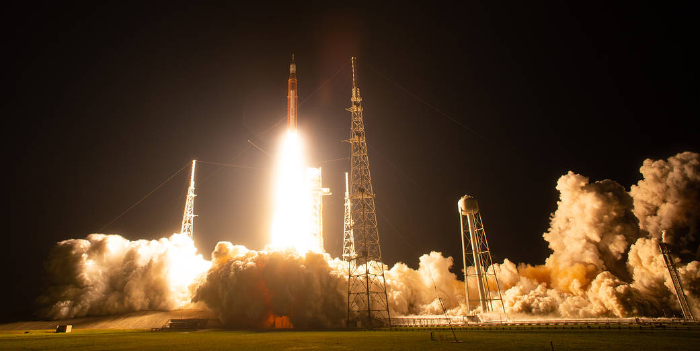

# Predicting Rocket Launch Delays

**Dr. Mohammed Hussin Talafha** · University of Sharjah  
**الدكتور محمد حسين طلافحة — التنبؤ بتأخيرات إطلاق الصواريخ**

Rocket Revolution · World Space Week 2026 · SSAH  
**7 October 2026 · 11:00–13:00 UAE time (UTC+4)**

Build a model, change a launch scenario, and explain your prediction.
Two hands-on sessions, **60 minutes each**. You can work alone or with a partner;
no previous machine-learning experience is needed.

## Start here

You need a laptop, a GitHub account with Codespaces access, and an internet connection.
Allow about 10 minutes for the first setup.

1. Click **Open in GitHub Codespaces** above, then create the Codespace.
2. Wait for setup to finish and the **Ready** message to appear.
3. Open [Notebook 01](notebooks/01_launch_delay_detectives.ipynb).
4. Click **Select Kernel** at the top right and choose **Python (Rocket Workshop)**.
5. Run cells from top to bottom with **Shift+Enter**. Stop at each **YOUR TURN** to try the activity.

## Your two sessions

| Time (UAE) | Open this notebook | What you will do |
|---|---|---|
| 11:00–12:00 | [01 — Launch-delay detectives](notebooks/01_launch_delay_detectives.ipynb) | Explore the data, train a decision tree, and predict a new attempt. |
| 12:00–13:00 | [02 — From predictions to decisions](notebooks/02_launch_delay_decisions.ipynb) | Compare models, choose an alert threshold, and explore scenarios with sliders. |

Select the same kernel in Notebook 02 and start from its first cell.
Each notebook runs independently. GitHub shows saved examples; open Codespaces to
edit code and use the sliders. Code comments explain every non-empty code line.

## The challenge

**One hour before launch, will this attempt be delayed by more than 15 minutes or scrubbed?**
A scrub means that the attempt is cancelled. Exactly 15 minutes counts as on time
for this exercise. Your model predicts a yes/no flag, not the number of delay minutes.

The included dataset has **960 simulated attempts**. All vehicles, pads, forecasts,
and outcomes are fictional. Results describe this simulation, not real launch
reliability or launch clearance. See the [data dictionary](data/README.md) when you
need a column's meaning or units.

*Artemis I, 16 November 2022. Credit: NASA/Joel Kowsky. [Source and image credits](assets/IMAGE_CREDITS.md).*

## Save your work

Press **Ctrl+S** (Mac: **Cmd+S**) to save your notebook edits. Notebook 02 also saves
your mini report and result tables in `artifacts/`. In the Codespaces Explorer,
right-click a file and choose **Download** to keep a copy.

When finished, open the Command Palette and run **Codespaces: Stop Current Codespace**.

## Need help?

| Problem | Try this |
|---|---|
| Kernel missing or `ModuleNotFoundError` | Choose **Select Another Kernel → Python Environments → .venv/bin/python**. If setup failed, run `bash .devcontainer/post-create.sh` in the terminal, then select the kernel again. |
| `NameError` | Restart the kernel, then run every earlier code cell in order. |
| Sliders are blank | Run the preceding cells, then rerun the slider cell. You can also edit the scenario table directly. |
| Codespaces unavailable | Work with a partner who has a running Codespace. |

[Data dictionary](data/README.md) · [Image credits](assets/IMAGE_CREDITS.md) · [MIT licence](LICENSE)
